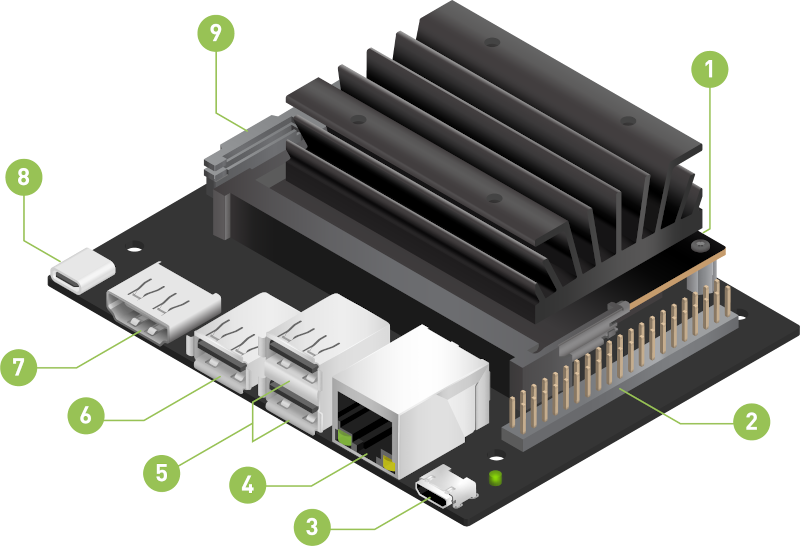
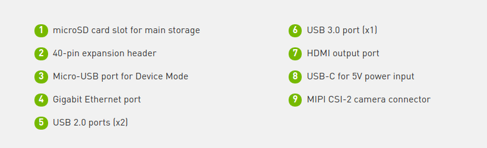

## Jetson Nano

### Quick Start

_NVIDIA® Jetson Nano™ Developer Kit is a small, powerful computer that lets you run multiple neural networks in parallel for applications like image classification, object detection, segmentation, and speech processing._

The main source of information for getting hands on is the official website of Nvidia Developer, this document is meant to give you easy access to the official documentation.

[Getting Started with Jetson Nano 2GB Developer Kit
](https://developer.nvidia.com/embedded/learn/get-started-jetson-nano-2gb-devkit)

***What do you need:***

- Nvidia Jetson Nano
- MicroSD card 32 Gb (64 Gb or more recommended)
- HDMI Display
- USB Keyboard and mouse
- USB-C power supply (5V⎓3A) (The charger of some smartphones comply with this specs)

- To prepare your microSD card, you’ll need a computer with Internet connection and the ability to read and write SD cards, either via a built-in SD card slot or adapter.

*Note:* You can also interact with your Jetson Nano via terminal (Headless Mode) from another computer, in that case, the USB Keyboard, mouse and HDMI dispaly are not necesary.

⚠️ To avoid damage, always place your Jetson Nano on a non-conductive surface.

### Write Image to the microSD Card

Intructions available for different operative systems (OS). 

- [Write Image to the microSD Card](https://developer.nvidia.com/embedded/learn/get-started-jetson-nano-2gb-devkit#prepare)

_It might take more than 10 minutes to write the image to the microSD card, take a break and come back later._

### Setup and First Boot

[Setup and First Boot](https://developer.nvidia.com/embedded/learn/get-started-jetson-nano-2gb-devkit#setup)

### Virtual Network Computing

_VNC (Virtual Network Computing) enables you to control your Jetson developer kit from another computer on the same network, by viewing and interacting with the desktop of the developer kit from the other computer._

In a few works, you can get remote access to your Jetson nano

[Remote Control](https://developer.nvidia.com/embedded/learn/tutorials/vnc-setup)
